<div align="center">


</div>
<p align="center">
       🖥️  <a href="https://github.com/bilibili/Index-anisora/tree/main">GitHub</a> &nbsp&nbsp  |  &nbsp&nbsp🤗 <a href=https://huggingface.co/IndexTeam/Index-anisora>Hugging Face</a>&nbsp&nbsp |  &nbsp&nbsp🤖 <a href=https://www.modelscope.cn/organization/bilibili-index>Model Scope</a>&nbsp&nbsp | 📑 <a href='http://arxiv.org/abs/2412.10255'></a> &nbsp&nbsp ｜  📑 <a href='http://arxiv.org/abs/2504.10044'></a> &nbsp&nbsp

**English** | [**中文简体**](./README_CN.md)

<br>

----

[**Index-AniSora:The Ultimate Open-Source Anime Video Generation Model**](http://arxiv.org/abs/2412.10255) <be> 

This Project presenting Bilibili's gift to the anime world - Index-AniSora, the most powerful open-source animated video generation model.
It enables one-click creation of video shots across diverse anime styles including series episodes, Chinese original animations, manga adaptations, VTuber content, anime PVs, mad-style parodies(鬼畜动画), and more!
Powered by our IJCAI'25-accepted work  <a href='http://arxiv.org/abs/2412.10255'>AniSora: Exploring the Frontiers of Animation Video Generation in the Sora Era </a>


## 📣 Updates
- `2025/10/31` 🔥 we have released the anisora-anymask model weights, supporting image-to-video generation with temporal and spatial masks. [Huggingface](https://huggingface.co/IndexTeam/Index-anisora/tree/main/anymask) [Model Scope](https://modelscope.cn/models/bilibili-index/Index-anisora/files)
- `2025/09/25` 🔥The 12GB VRAM available version of V3.1 has been uploaded to ModelScope. [Model Scope](https://modelscope.cn/models/bilibili-index/Index-anisora/file/view/master/wan.7z) [Download](https://www.modelscope.cn/models/bilibili-index/Index-anisora/resolve/master/wan.7z)
- `2025/09/23` 🔥We have released V3.2 weights,  which is trained on the stronger wan2.2 model and can reduce the number of inference steps to 8. Just like version 3.1, it has added arbitrary-frame inference and character 3D video generation. [Huggingface](https://huggingface.co/IndexTeam/Index-anisora/tree/main/V3.2) [Model Scope](https://www.modelscope.cn/models/bilibili-index/Index-anisora/files)
- `2025/09/04` 🔥We have released V3.1 weights, which provide enhanced motion range capabilities. For optimal results, we strongly recommend using the v3.1 weights with a motion score setting of 2.0–4.0. [Huggingface](https://huggingface.co/IndexTeam/Index-anisora/tree/main/V3.1) [Model Scope](https://www.modelscope.cn/models/bilibili-index/Index-anisora/files)
- `2025/08/27` 🔥🔥Anisora V3 weights are now licensed under Apache 2.0 and publicly available for download on ModelScope and Hugging Face. The new version supports <font color="orange"> arbitrary-frame inference, character 3D video generation, Video style transfer, Multimodal Guidance, Ultra-Low-Resolution Video Super-Resolution</font>, delivering greater overall dynamics and more natural motion. The V3 model can generate 5 sec 360p video shot within 8 sec.
- `2025/08/27` 🔥🔥We have submitted our work on agent-related research <font color="orange">AniMe</font> to arXiv. Stay tuned for further updates! <a href='http://arxiv.org/abs/2508.18781'></a>
- `2025/07/11` 🔥Anisora V2 weights are now licensed under Apache 2.0 and publicly available for download on ModelScope and Hugging Face.
- `2025/07/10` Fix Anisora V1 inference bug, which may case video artifacts. 
- `2025/07/02` 🔥🔥AniSora V3 Preview is updated, we will share our new progress in Siggraph Day 07/11. Join Us!
- `2025/05/12` 🔥🔥Everything we build is open-source. Check Out Now!!!
- `2025/05/10` 🔥Our paper is accepted by IJCAI25. Camera Ready Version is updated. 
- `2024/12/19` We submitted our paper on arXiv and released our project with evaluation benchmark.

## 📣 Join Us 
**This github project is the only official homepage of the Anisora project. Any websites not listed on the official homepage are not affiliated with the project team.**

Access benchmark or all videos generated by AniSoraV1 and AniSoraV2 on the benchmark, fill the  <a href="assets/anisora_benchmark_agreement_form.doc">form</a> and send PDF format to jiangyudong@bilibili.com or yangsiqian@bilibili.com or xubaohan@bilibili.com (links provided after agreeing with Bilibili).
The signature must be handwritten and include the name of the affiliated company or academic institution.
Join us! Send your CV to jiangyudong@bilibili.com
If you want to learn more about AniSora, join the group chat.

<picture>
  
</picture>


## Project Guide

### AniMe
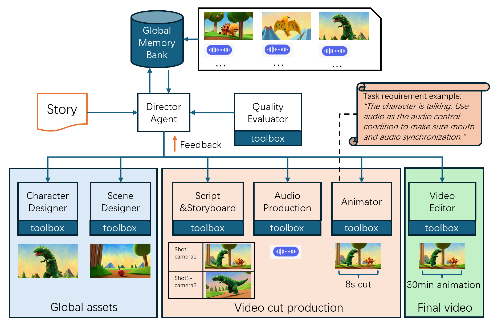

### Long Animation Demos Powered by AniMe and AniSora
| Fiction to Video | 2D Cartoon Adaptation|  3D Cartoon Adaptation| Comic to Video | 
| --- | ---  |--- | ---  | 
| [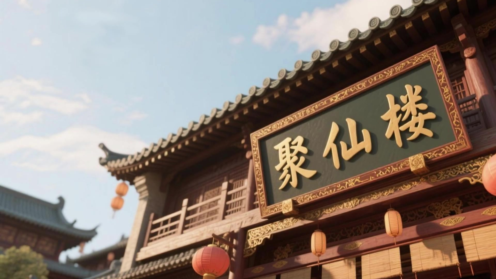](https://www.bilibili.com/video/BV1KGe1zrE3G)| [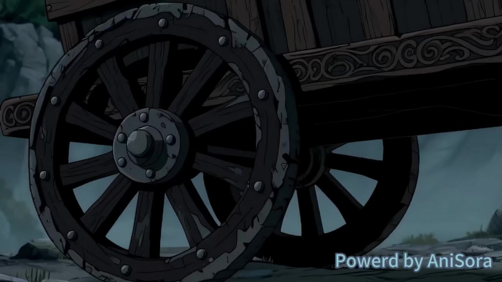](https://www.bilibili.com/video/BV1uAe1zmEmu) | [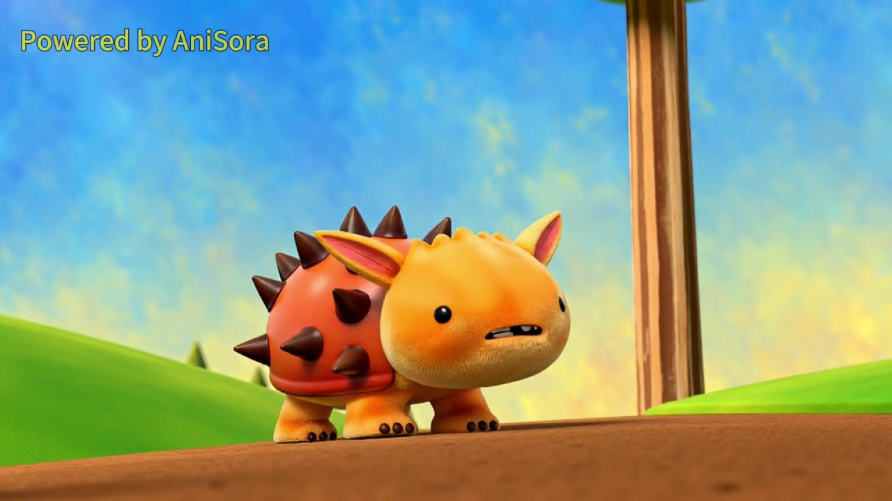](https://www.bilibili.com/video/BV18Ne1zjE7X) | [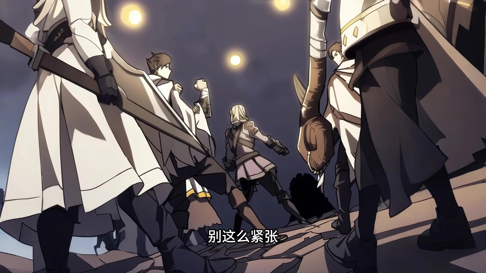](https://www.bilibili.com/video/BV1NGe1zrEHp)| 

### AniSoraV3
Find in 📁 `anisoraV3`

<div align="center">
    <video src="https://github.com/user-attachments/assets/a207d43e-26f6-445b-883e-9b28c129607f" controls width="30%" poster=""></video>
</div>

- Character 3D video generation

Given a front-facing character illustration, generate a 360-degree rotation video to achieve multi-angle consistent visual modeling of the character. This assists in maintaining consistency across different shot angles and supports 3D modeling, among other applications.

| Demo1 | Demo2|  Demo3| Demo4 | Demo5|  
| --- | ---  |--- | ---  | ---  |
||||||

- Arbitrary-frame inference

| first frame | mid frame| last frame  | Video  |
| --- | --- | --- | ---  |
|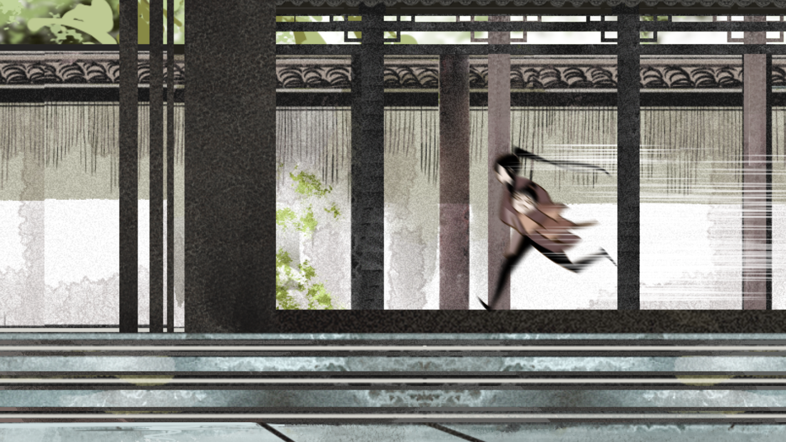 | | ||
|| 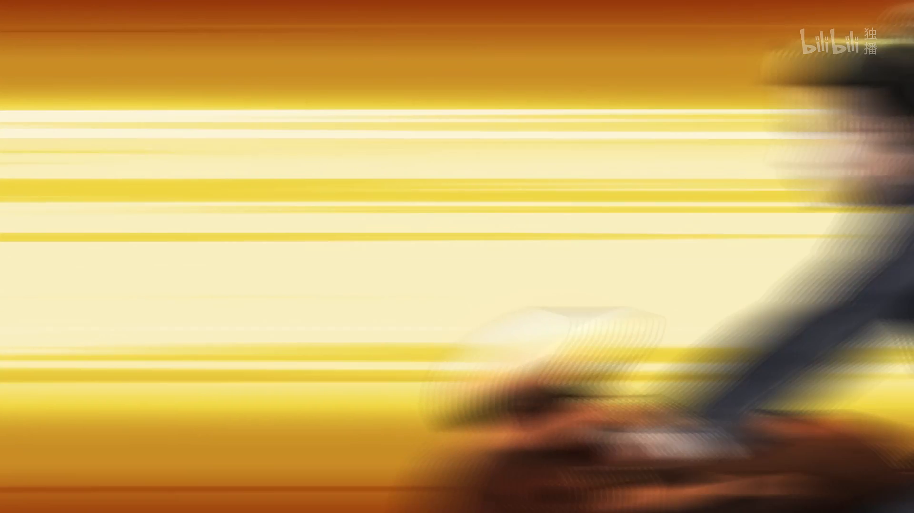  | ||

- Video style transfer

By leveraging image generation from the first and last frames combined with line art-based video generation, original videos can be transformed into videos of any desired style.

| origin frame | transferred frame| video input | video transfer  |
| --- | --- | --- | --- |
|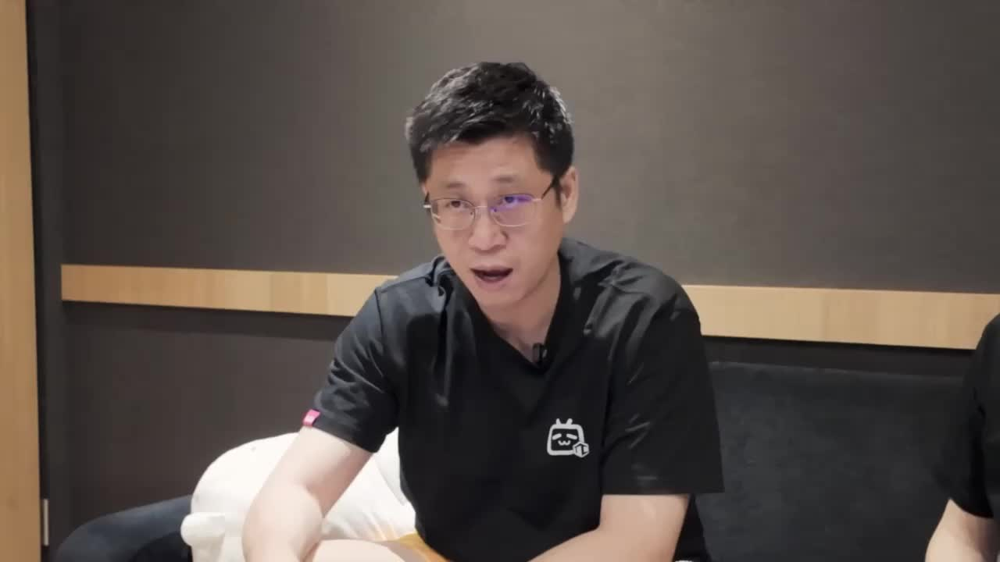 |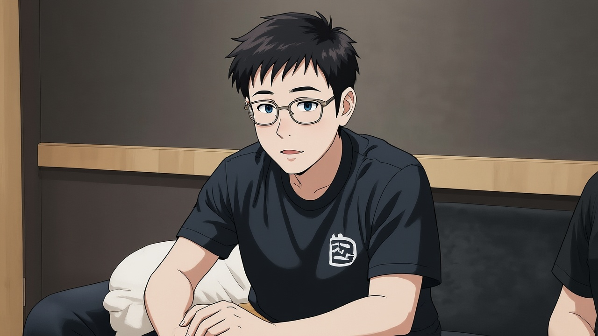 | 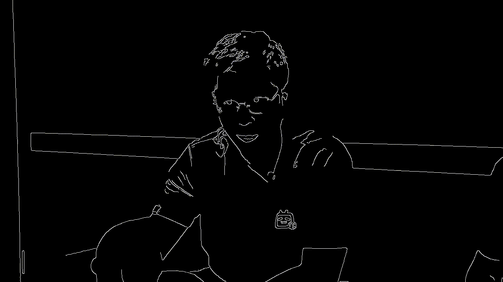|| 


- Multimodal Guidance

Pose, depth, line art, and audio guidance: Enable precise control over generated video motions through multiple guidance mechanisms.

| input | prompt |  Video  |
| --- | --- | --- |
| 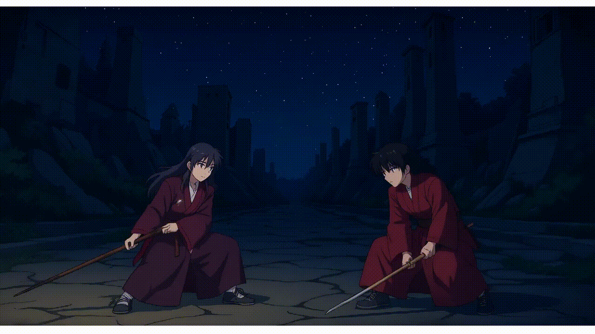  |The boy in red and the girl in red are fencing in the scene.|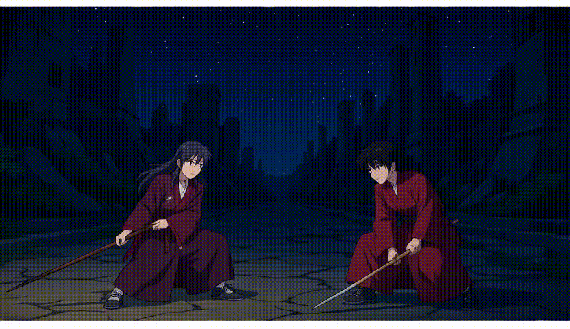| 
|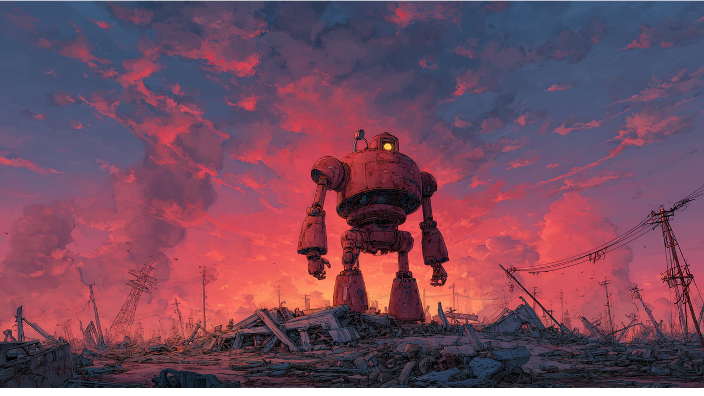 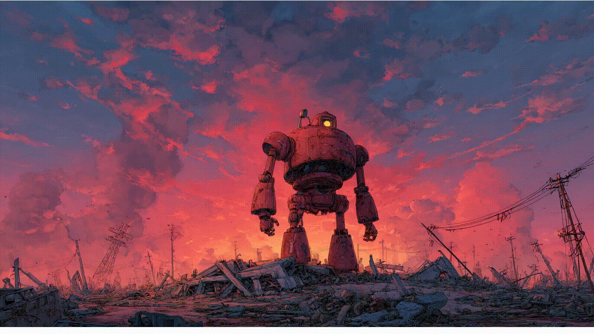  |A worn-out red robot flings its arm away, only to have it fly back and reassemble with a new arm holding a sword.|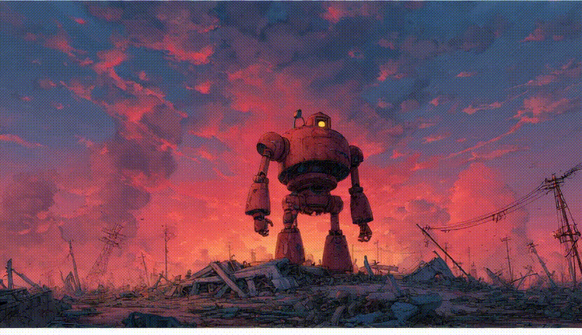| 
|Audio + img  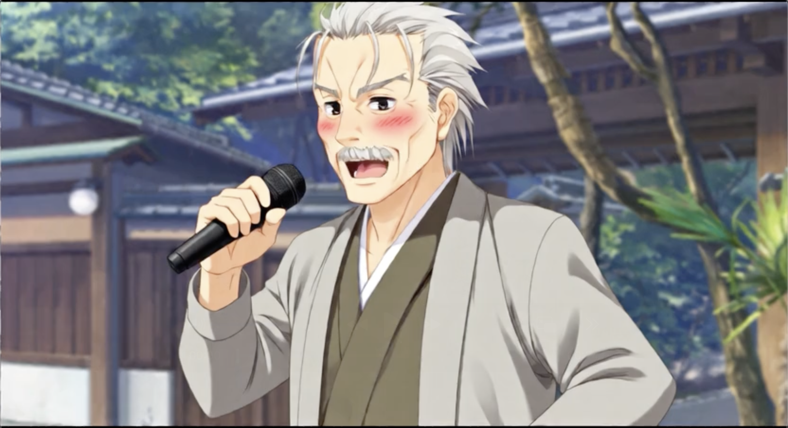  | - |  <video src="https://github.com/user-attachments/assets/b3d6038e-35d4-4712-b748-bbaf42e0260e" controls width="100"></video> | 

- Ultra-Low-Resolution Video Super-Resolution

Supports upscaling from 90p to 720p/1080p, enabling the generation of videos with richer details using fewer sampling steps.

| generated low-resolution  video | high-resolution video(1080p)| GT |
| --- | --- | --- |
|   |  |  |
|  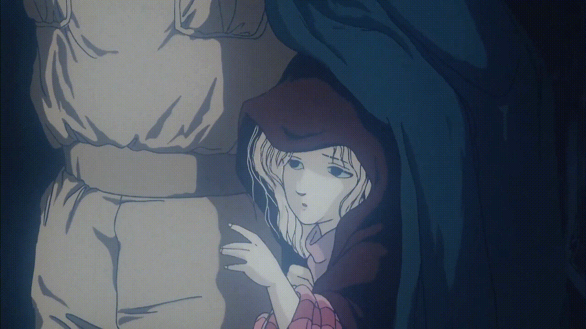 |  |   |


### AniSoraV2.0
Find in 📁 `anisoraV2_gpu`, `anisoraV2_npu` 


Powered by the enhanced Wan2.1-14B foundation model for superior stability.
- Distillation-accelerated inference without quality compromise, faster and cheaper
- Full training/inference code release
- Native support Huawei Ascend 910B NPUs (entirely trained on domestic chips) 📁 `anisoraV2_npu`.
- High quality video shots generation, covers 90% of application scenarios

### AniSoraV1.0
Find in 📁 `anisoraV1_infer`

<div align="center">
    <video src="https://github.com/user-attachments/assets/4351fc5e-f7fd-456b-807e-82fdcb321de2" controls width="30%" poster=""></video>
</div>

Trained on the CogVideoX-5B foundation model, with full training and inference code released. 
- Localized region guidance for video control
- Temporal guidance (first/last frame guidance, keyframe interpolation, multi-frame guidance)
- Full training and inference code release. Find in 📁 `anisoraV1_train_npu`
- Cost-effective deployment on RTX 4090
- Covers 80% of application scenarios

### Ecosystem Tools
Find in 📁 `data_pipeline`

End-to-end dataset pipeline for rapid training data expansion.
- Animate data cleaning pipeline.

### Anime-optimized Benchmark System
Find in 📁 `reward`

Specialized evaluation models and scoring algorithms for anime video generation, includes reward models suitable for reinforcement learning and benchmarking. 
- Tailored evaluation framework for animation generation
- Standard test dataset aligned with ACG aesthetics
- Human Preference Alignment

The benchmark dataset contains 948 animation video clips are collected and labeled
with different actions. Each label contains 10-30 video clips. The corresponding text prompt is generated by Qwen-VL2 at first, then is corrected manually to guarantee the text-video alignment.


### AniSoraV1.0_RL
Find in 📁 `anisora_rl`

The first RLHF framework for anime video generation. 
- RL-optimized AniSoraV1.0 for enhanced anime-style output
- Methodology detailed in our preprint: <a href='http://arxiv.org/abs/2504.10044'> Aligning Anime Video Generation with Human Feedback </a>

---
## 💡 Abstract
Animation has gained significant interest in the recent film and TV industry. Despite the success of advanced video generation models like Sora, Kling, and CogVideoX in generating natural videos, they lack the same effectiveness in handling animation videos. Evaluating animation video generation is also a great challenge due to its unique artist styles, violating the laws of physics and exaggerated motions. In this paper, we present a comprehensive system, **AniSora**, designed for animation video generation, which includes a data processing pipeline, a controllable generation model, and an evaluation dataset. Supported by the data processing pipeline with over 10M high-quality data, the generation model incorporates a spatiotemporal mask module to facilitate key animation production functions such as image-to-video generation, frame interpolation, and localized image-guided animation. We also collect an evaluation benchmark of 948 various animation videos, the evaluation on VBench and human double-blind test demonstrates consistency in character and motion, achieving state-of-the-art results in animation video generation.

## 🖥️ Method

The overview of Index-anisora is shown as follows.

<picture>
  
</picture>

Features:

1. We develop a comprehensive video processing system that significantly enhances preprocessing for video generation.

2. We propose a unified framework designed for animation video generation with a spatiotemporal mask module, enabling tasks such as image-to-video generation, frame interpolation, and localized image-guided animation.

3. We release a benchmark dataset specifically for evaluating animation video generation.

## 📑 Evaluation

Evaluation results on Vbench:

| Method                   | Motion Smoothness | Motion Score | Aesthetic Quality | Imaging Quality | I2V Subject | I2V Background | Overall Consistency | Subject Consistency |
|--------------------------|-------------------|--------------|-------------------|-----------------|-------------|----------------|---------------------|---------------------|
| Opensora-Plan(V1.3)  | 99.13            | 76.45        | 53.21            | 65.11           | 93.53       | 94.71          | 21.67              | 88.86              |
| Opensora(V1.2)       | 98.78            | 73.62        | 54.30            | 68.44           | 93.15       | 91.09          | 22.68              | 87.71              |
| Vidu                 | 97.71            | **77.51**        | 53.68            | 69.23           | 92.25       | 93.06          | 20.87              | 88.27              |
| Covideo(5B-V1)       | 97.67            | 71.47        | **54.87**            | 68.16           | 90.68       | 91.79          | 21.87              | 90.29              |
| MiniMax              | 99.20            | 66.53        | 54.56            | **71.67**           | 95.95       | **95.42**          | 21.82              | 93.62              |
| **AniSora**              | **99.34**        | 45.59        | 54.31            | 70.58           | **97.52**       | 95.04          | 21.15              | **96.99**              |
| AniSora-K            | 99.12            | 59.49        | 53.76            | 68.68           | 95.13       | 93.36          | 21.13              | 94.61              |
| AniSora-I            | 99.31            | 54.96        | 54.67            | 68.98           | 94.16       | 92.38          | 20.47              | 95.75              |
| GT                   | 98.72            | 56.05        | 52.70            | 70.50           | 96.02       | 95.03          | 21.29              | 94.37              |


Evaluation results on AniSora-Benchmark:

| Method                   | Human Evaluation | Visual Smooth | Visual Motion | Visual Appeal | Text-Video Consistency | Image-Video Consistency | Character Consistency |
|--------------------------|------------------|---------------|---------------|---------------|------------------------|-------------------------|-----------------------|
| Vidu-1.5                 | 60.98            | 55.37         | **78.95**     | 50.68         | 60.71                  | 66.85                   | 82.57                 |
| Opensora-V1.2            | 41.10            | 22.28         | 74.90         | 22.62         | 52.19                  | 55.67                   | 74.76                 |
| Opensora-Plan-V1.3       | 46.14            | 35.08         | 77.47         | 36.14         | 56.19                  | 59.42                   | 81.19                 |
| CogVideoX-5B-V1          | 53.29            | 39.91         | 73.07         | 39.59         | 67.98                  | 65.49                   | 83.07                 |
| MiniMax-I2V01            | 69.63            | 69.38         | 68.05         | 70.34     | 76.14              | 78.74                   | 89.47                 |
| Wan-2.1            | -            | 81.70        | 61.88         | 82.05    | 87.80              | 88.50                   | 90.65                 |
| **AniSora-V1 (Ours)**       | **70.13**        | 71.88     | 48.45         | 65.38         | 74.26                  | 82.66               | **94.88**             |
| **AniSora-V2 (Ours)**       | -        | **86.98**     | 50.34         | **85.91**         | **90.98**                  | **91.96**               | 92.75             |
| AniSora-V1 (Interpolated Avg) | -             | 70.78         | 53.02         | 64.41         | 73.56                  | 80.62                   | 91.59                 |
| AniSora-V1 (KeyFrame Interp) | -             | 70.03         | 58.10         | 64.57         | 74.57                  | 80.78                   | 91.98                 |
| AniSora-V1 (KeyFrame Interp) | -             | 70.03         | 58.10         | 64.57         | 74.57                  | 80.78                   | 91.98                 |
| GT                       | -                | 92.20         | 58.27         | 89.72         | 92.51                  | 94.69                   | 95.08                 |


AniSora for our I2V results.

AniSora-K for the key frame interpolation results.

AniSora-I for the average results of frame interpolation conditions, including key frame, last frame, mid frame results.


## 🤗 Acknowledgments
We would like to express our sincere thanks to the [CogVideoX](https://github.com/THUDM/CogVideo)、[Wan2.1](https://github.com/Wan-Video/Wan2.1)、[FasterCache](https://github.com/Vchitect/FasterCache) and [OSS](https://github.com/bebebe666/OptimalSteps) for their valuable work.
A special thanks to the creators of the AniSora community, such as "花染色" for their valuable suggestions on the project.


## 📚 Citation

🌟 If you find our work helpful, please leave us a star and cite our paper.

```
@article{jiang2024anisora,
  title={AniSora: Exploring the Frontiers of Animation Video Generation in the Sora Era},
  author={Yudong Jiang, Baohan Xu, Siqian Yang, Mingyu Yin, Jing Liu, Chao Xu, Siqi Wang, Yidi Wu, Bingwen Zhu, Xinwen Zhang, Xingyu Zheng,Jixuan Xu, Yue Zhang, Jinlong Hou and Huyang Sun},
  journal={arXiv preprint arXiv:2412.10255},
  year={2024}
}
```

